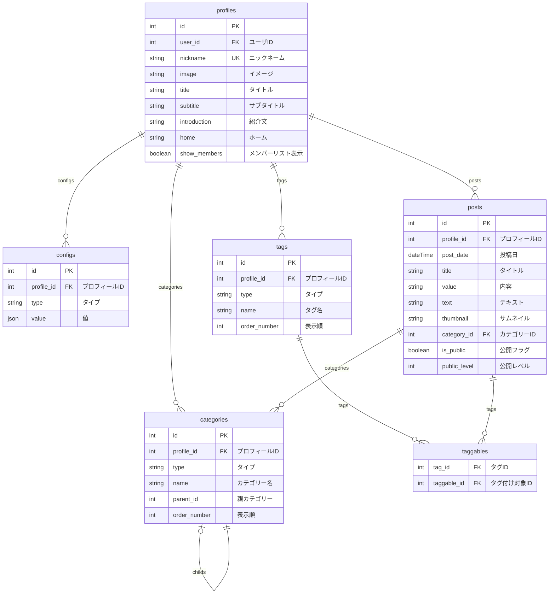

# Feeldee Framework

feeldee-frameworkは、日記、フィールドノート、趣味や活動の記録に特化したCMSを構築するためのLaravelパッケージです。

## ER図

## 開発者

### 導入方法

1. `git clone ryossi/feeldee-framework`でパッケージをダウンロードします。 
2. `composer install`でPHPの依存パッケージをインストールします。

### テスト環境

通常のテストは、コマンドプロンプトで以下のコマンドを実行してください。

`./vendor/bin/phpunit --testsuite Feature`

### XDebug利用

1. `cp .env.example .env`で.envをコピーして設定をカスタマイズしてください。
2. `docker compose up -d`でテストコンテナを起動してください。
3. `docker exec -it feeldee-framework bash`でテストコンテナに入ります。
4. ソースコードの必要な部分にブレイクポイントを設定します。
5. テストコンテナのコマンドプロンプトで`./vendor/bin/phpunit --testsuite Feature`を実行してください。
6. 最後に`docker compose down`でテストコンテナを終了します。

## ライセンス

このプラグインは、[MIT licence.](https://opensource.org/licenses/MIT)のもとで公開されています。

## 参考

- テスト環境には、[Testbench](https://github.com/orchestral/testbench)を利用しています。
